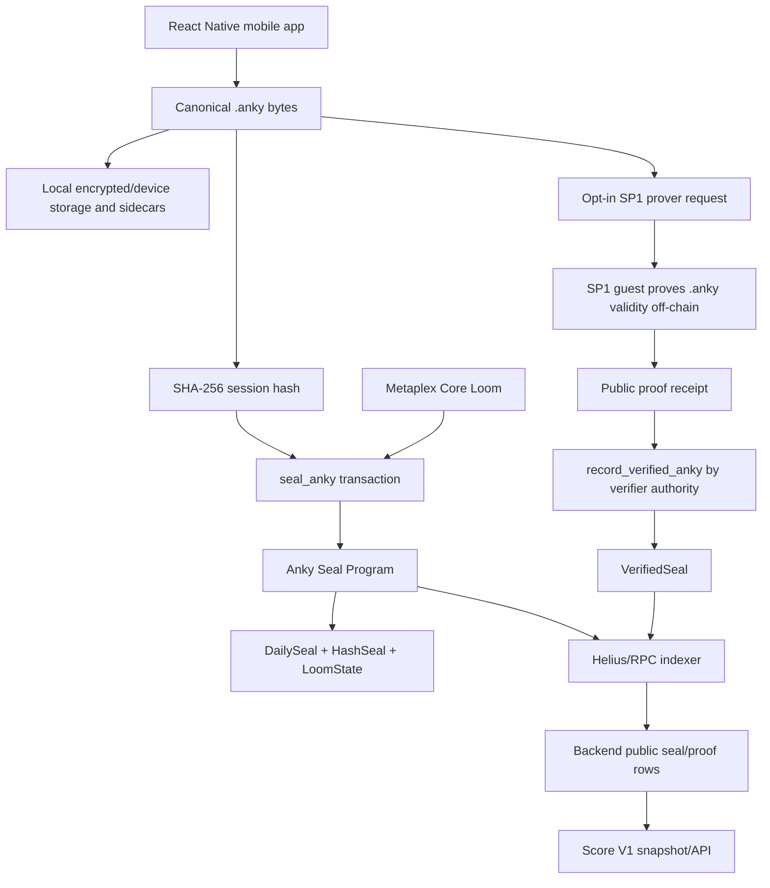

# Anky Technical Source Of Truth

Status: evidence-backed source of truth as of 2026-05-07.

This file describes what the Anky monorepo currently supports, what is only configured, what conflicts, and what must not be claimed.

## 1. System Summary

**CURRENT:** Anky is a mobile-first private writing practice. A user writes an 8-minute `.anky` session locally, the app hashes the exact UTF-8 bytes, and the user can seal the hash on Solana using a Metaplex Core Loom and the Anky Seal Program.

**CURRENT:** The canonical public proof statement is:

```text
Wallet W privately completed one valid .anky rite for UTC day D,
producing hash H, without revealing the writing.
```

**CURRENT:** The public layer stores only public metadata: wallet, Loom/Core collection, UTC day, session hash, signatures, proof hash, verifier, protocol version, slot/block time, and status.

**CONFLICT:** Older web/backend/docs paths also exist. They include legacy plaintext writing tables and broader product narratives. They must not be treated as the current mobile proof-of-practice privacy surface.

## 2. Architecture

**CURRENT:** The active Sojourn 9 launch architecture is:



**CONFIGURED-BUT-UNVERIFIED:** Backend proof routes and operator scripts are wired, but this documentation pass did not execute an end-to-end proof job or send a transaction.

## 3. Canonical `.anky` Protocol

**CURRENT:** A `.anky` file is a plain UTF-8 text capture of forward-only accepted characters and timing.

Format:

```text
{epoch_ms} {character_or_SPACE}
{delta_ms_0000_to_7999} {character_or_SPACE}
...
8000
```

Rules:

- **CURRENT:** The first line stores Unix epoch milliseconds and the first accepted character.
- **CURRENT:** Subsequent lines store four-digit deltas capped at `7999`.
- **CURRENT:** Typed spaces are encoded as the exact `SPACE` token.
- **CURRENT:** The terminal line is exactly `8000` with no data after it.
- **CURRENT:** Files must be LF-only and must not include a BOM.
- **CURRENT:** Hashing is `sha256(raw_utf8_bytes_of_the_file)`.
- **CURRENT:** The mobile parser, SP1 parser, backend validator, and tests reject malformed files.

Evidence: `apps/anky-mobile/src/lib/ankyProtocol.ts`, `apps/anky-mobile/src/lib/ankyProtocol.test.ts`, `static/protocol.md`, `solana/anky-zk-proof/src/lib.rs`, `src/routes/mobile_sojourn.rs`.

Boundary:

- **CURRENT:** The protocol proves structure and byte integrity.
- **CURRENT:** Public anchoring proves a hash existed no later than the anchor timestamp under a wallet.
- **CONFLICT:** The protocol does not prove unaided humanness, authorship, or that the chain saw plaintext.

## 4. Mobile App

**CURRENT:** The active mobile app is in `apps/anky-mobile`.

Core paths:

- `src/screens/WriteScreen.tsx`
- `src/screens/RevealScreen.tsx`
- `src/lib/ankyProtocol.ts`
- `src/lib/inputPolicy.ts`
- `src/lib/ankyStorage.ts`
- `src/lib/ankyState.ts`
- `src/lib/solana/sealAnky.ts`
- `src/lib/solana/ankySolanaConfig.ts`
- `src/lib/solana/mobileLoomMint.ts`
- `src/lib/api/ankyApi.ts`

Behavior:

- **CURRENT:** `WriteScreen` captures forward-only input, rejects noncanonical edit operations through `inputPolicy`, saves active drafts, and closes after the 8-second silence marker.
- **CURRENT:** The rite duration constants are 8 minutes and 8 seconds of final silence.
- **CURRENT:** `ankyStorage` writes local `.anky` files by hash and refuses conflicting overwrites.
- **CURRENT:** `RevealScreen` computes/parses the hash, can seal through `sealAnky`, can request reflections, and can request proof through `/api/mobile/seals/prove`.
- **CURRENT:** Mobile "verified" local validity is different from `proof_verified`. Proof state requires public proof metadata and matching protocol/verifier checks.

## 5. Sojourn 9

**FOUNDER-DOCTRINE / PUBLIC CANON:** Sojourn 9 is a 96-day writing pilgrimage divided into 12 regions of 8 days and bounded by 3,456 vessels. The 8 kingdoms/chakras/colors remain valid as an inner symbolic cycle, not the public season partition.

Evidence: `static/sojourn9.md`, `sojourn9/constitution/SOJOURN_9.md`.

**CURRENT:** Mobile code models Sojourn 9 as starting at `2026-03-03T00:00:00.000Z`, length 96 days, with 8 kingdoms of 12 days in `apps/anky-mobile/src/lib/sojourn.ts`.

**LAUNCH CANON:** Public copy should say `12 regions x 8 days = 96 days`. If the mobile implementation still names `8 kingdoms x 12 days`, treat that as an internal symbolic/calendar naming detail until code is deliberately migrated.

**CURRENT:** The `sojourn9/` package still contains historical Bubblegum/cNFT scaffold notes, now fenced as noncanonical for this launch. The active launch path is React Native mobile, Metaplex Core Looms, and `solana/anky-seal-program`.

## 6. Great Slumber

**PLANNED / FOUNDER-DOCTRINE:** The supplied goal says Anky has 21-day Great Slumbers.

**UNKNOWN:** No implementation enforcing a 21-day Great Slumber was found. The only code reference found is a TODO in `apps/anky-mobile/src/lib/sojourn.ts` that says post-day-96 users should be routed into Great Slumber or the next sojourn.

Launch wording:

- Safe: "Great Slumber is the planned post-sojourn rest/integration phase."
- Unsafe: "The app currently enforces a 21-day Great Slumber."

## 7. Looms

**CURRENT:** Active Looms are Metaplex Core assets. The current seal program checks Core asset account ownership, official collection membership, and writer ownership.

Evidence:

- `solana/anky-seal-program/programs/anky-seal-program/src/lib.rs`
- `apps/anky-mobile/src/lib/solana/mintLoom.ts`
- `apps/anky-mobile/src/lib/solana/mobileLoomMint.ts`
- `src/routes/mobile_sojourn.rs`

**CURRENT:** Default devnet collection and Core program values are present in mobile/backend/Anchor config.

**UNKNOWN:** Mainnet Core collection finality and authority are not proven by repo evidence.

**RISK:** Core account parsing in the Anchor program is hand-rolled. Unit tests include public devnet Core asset layout examples, but a robust live integration gate is still a mainnet blocker.

## 8. Anky Seal Program

**CURRENT:** Active path:

```text
solana/anky-seal-program/programs/anky-seal-program/src/lib.rs
```

Declared program ID:

```text
4GjZaHbyyeVEjeYjm2q7vVdnNhMPnNMx8oeRwEBZDsMX
```

Instructions:

- **CURRENT:** `seal_anky(session_hash, utc_day)`
- **CURRENT:** `record_verified_anky(session_hash, utc_day, proof_hash, protocol_version)`

Accounts:

- **CURRENT:** `LoomState`
- **CURRENT:** `DailySeal`
- **CURRENT:** `HashSeal`
- **CURRENT:** `VerifiedSeal`

Events:

- **CURRENT:** `AnkySealed`
- **CURRENT:** `AnkyVerified`

Rules enforced:

- **CURRENT:** `seal_anky` requires current UTC day according to Solana clock.
- **CURRENT:** One `DailySeal` per writer/day PDA.
- **CURRENT:** One `HashSeal` per writer/session-hash PDA.
- **CURRENT:** Loom asset and collection account owners must be Metaplex Core.
- **CURRENT:** Loom asset owner must equal writer.
- **CURRENT:** Loom asset update authority collection must be the configured official collection.
- **CURRENT:** `record_verified_anky` requires the hardcoded verifier authority and protocol version `1`.
- **CURRENT:** `record_verified_anky` binds to an existing matching `HashSeal`.

Mainnet:

- **UNKNOWN:** `Anchor.toml` includes mainnet config, but a mainnet deployment signature or explorer verification was not found in this pass.

## 9. SP1 / Proof Layer

**CURRENT:** The proof path lives in `solana/anky-zk-proof`.

Components:

- `src/lib.rs`: shared `.anky` parser and receipt builder.
- `src/main.rs`: local receipt CLI.
- `sp1/program/src/main.rs`: SP1 guest.
- `sp1/script/src/bin/main.rs`: execute/prove/verify script.
- `sp1/script/src/bin/vkey.rs`: verification key printer.

Public receipt fields:

- version
- protocol
- writer
- session_hash
- utc_day
- started_at_ms
- accepted_duration_ms
- rite_duration_ms
- event_count
- valid
- duration_ok
- proof_hash

**CURRENT:** SP1 proves private `.anky` validity off-chain and commits public receipt values.

**CURRENT:** The on-chain `VerifiedSeal` is verifier-authority-attested after off-chain SP1 verification.

**CONFLICT:** Direct on-chain SP1/Groth16 verification is not implemented today.

Safe wording:

- "ZK-enabled proof-of-practice."
- "SP1 proves private `.anky` validity off-chain."
- "The current on-chain verified badge is verifier-authority-attested after off-chain SP1 verification."

Forbidden wording:

- "Fully trustless ZK on Solana."
- "Solana verifies the SP1 proof directly today."

## 10. Backend

**CURRENT:** Main current mobile route file:

```text
src/routes/mobile_sojourn.rs
```

Relevant routes:

- `GET /api/mobile/solana/config`
- `POST /api/mobile/looms/mint-authorizations`
- `POST /api/mobile/looms/prepare-mint`
- `POST /api/mobile/looms/record`
- `GET /api/mobile/looms`
- `POST /api/mobile/reflections`
- `GET /api/mobile/reflections/{job_id}`
- `GET /api/mobile/seals`
- `GET /api/mobile/seals/score`
- `GET /api/mobile/seals/points`
- `POST /api/mobile/seals/record`
- `POST /api/mobile/seals/prove`
- `GET /api/mobile/seals/prove/{job_id}`
- `POST /api/mobile/seals/verified/record`
- `POST /api/helius/anky-seal`

Proof route behavior:

- **CURRENT:** Mainnet proof requests are disabled.
- **CURRENT:** Proof route validates the request hash against `rawAnky.as_bytes()`.
- **CURRENT:** It validates closed `.anky` structure and UTC day.
- **CURRENT:** It requires a matching recorded seal receipt.
- **CURRENT:** It requires prover env vars and a verifier keypair path but this pass did not read any keypair.
- **CURRENT:** It writes a temporary witness outside the repo, runs `proveAndRecordVerified.mjs`, redacts errors, deletes the witness, then upserts public verified metadata.

Backend privacy:

- **CURRENT:** Mobile public seal/proof tables are designed not to store `.anky` plaintext.
- **CURRENT:** Reflection processing reconstructs plaintext transiently for AI output.
- **CONFLICT:** Legacy tables and routes can store or serve plaintext or derived writing content. This must be scoped as legacy/noncanonical for Sojourn 9 privacy claims.

## 11. Database

Key migrations:

- **CURRENT:** `001_init.sql` creates legacy `writing_sessions.content TEXT NOT NULL` and `ankys` content/derived artifact tables.
- **CURRENT:** `009_sealed_sessions.sql` stores encrypted sealed session envelopes.
- **CURRENT:** `017_mobile_solana_integration.sql` creates mobile credits, Loom mints, seal receipts, reflection jobs, and states public witness rows do not store `.anky` contents.
- **CURRENT:** `019_mobile_verified_seal_receipts.sql` creates public verified receipt rows.
- **CURRENT:** `020_mobile_helius_webhook_events.sql` stores public Helius webhook payloads.
- **CURRENT:** `021_mobile_helius_webhook_signature_dedupe.sql` dedupes webhook signatures.
- **CURRENT:** `022_credit_ledger_entries.sql` creates RevenueCat credit history ledger rows.
- **CURRENT:** `023_mobile_proof_jobs.sql` exists in the working tree and describes public proof job metadata with transient witness handling outside the repo.

Privacy classification:

- Mobile seal/proof/indexing tables: public metadata only.
- Mobile reflection jobs: may include request/result sidecar metadata; plaintext handling depends on route behavior.
- Legacy web/session tables: not safe to describe as plaintext-free.

## 12. Helius, Indexer, And Score V1

**CURRENT:** The indexer lives in:

```text
solana/scripts/indexer/ankySealIndexer.mjs
```

It can:

- Parse Anchor `AnkySealed` and `AnkyVerified` logs.
- Decode public instruction data from Helius enhanced transaction/webhook payloads.
- Backfill finalized transactions through Helius/RPC.
- Build deterministic score snapshots.
- Post public seal/verified metadata to backend routes with an indexer secret.

Score rule:

```text
score = unique_seal_days + (2 * verified_seal_days) + streak_bonus
```

Where:

- `+1` per unique finalized sealed UTC day.
- `+2` extra for a matching finalized verified seal.
- `+2` per completed 7-day streak.
- Participant cap defaults to `3456`.
- Reward basis points default to `800`, or 8 percent, when token supply is provided.

**DEVNET-PROVEN:** `runbooks/sojourn9-helius-indexing.md` records one live devnet finalized `seal_anky` and `record_verified_anky` pair producing score `3` for a single wallet.

**NEEDS-EXTERNAL-VERIFICATION:** Active production Helius webhook status was not checked.

## 13. AI Reflections, Images, And Credits

**CURRENT:** Mobile reflections are optional post-rite processing. The mobile/backend path validates `.anky` and reconstructs text transiently for AI artifacts.

**CURRENT:** Credit costs in mobile types:

- reflection: 1
- image: 3
- full_anky: 5
- deep_mirror: 8
- full_sojourn_archive: 88

Evidence: `apps/anky-mobile/src/lib/api/types.ts`.

**CURRENT:** Production mobile credits use RevenueCat virtual currency `CREDITS` and packages granting 22, 99, and 421 credits.

Evidence: `apps/anky-mobile/docs/native-credit-products.md`, `apps/anky-mobile/src/lib/credits/revenueCatCredits.ts`, `apps/anky-mobile/src/lib/credits/products.ts`, `src/routes/mobile_sojourn.rs`.

**CONFLICT:** Older docs mention x402/USDC on Base and Stripe/other rails. They are not the current mobile credits source of truth.

## 14. `$ANKY`: The Memetic Distribution Layer

**CURRENT:** The repo has a `$ANKY` page under `templates/ankycoin.html` claiming the token was launched on pump.fun and displaying contract address:

```text
6GsRbp2Bz9QZsoAEmUSGgTpTW7s59m7R3EGtm1FPpump
```

**NEEDS-EXTERNAL-VERIFICATION:** The token's current supply, holders, liquidity, market state, and canonical mint status require Solana/pump.fun/DEX verification.

**CURRENT:** The same page says `$ANKY` does not unlock features or grant access.

**CONFIGURED-BUT-UNVERIFIED:** The indexer can compute an 8 percent reward allocation if raw token supply is supplied, but the repo does not prove:

- final token supply,
- reward custody wallet,
- claim contract,
- published snapshot time,
- dispute window,
- tax/legal treatment,
- mainnet final scoring data.

Therefore `$ANKY` distribution is not mainnet-ready as a public promise.

## 15. Privacy Model

Privacy truths:

- **CURRENT:** The canonical seal/proof/scoring system does not require storing `.anky` plaintext.
- **CURRENT:** The chain stores hashes and public receipt metadata only.
- **CURRENT:** The proof endpoint accepts plaintext only by explicit opt-in and routes it through transient SP1 witness handling.
- **CURRENT:** Helius/indexer/scoring operate on public chain data and webhook payloads only.
- **CONFLICT:** Legacy web/session tables can contain plaintext; do not make global "Anky never stores writing" claims without scoping them to the current mobile proof path.

Safe user-facing privacy statement:

> Your canonical Sojourn 9 proof stores only the hash and public receipt metadata. Your writing stays local unless you explicitly request reflection or proof processing. Reflection and proof paths may handle plaintext transiently, but the scoring system must not persist it.

## 16. Threat Model

**CURRENT:** Protected against:

- accidental hash mismatch,
- malformed `.anky` bytes,
- duplicate writer/day seal,
- duplicate writer/hash seal,
- incorrect Loom owner or collection in the current parser model,
- verified metadata from wrong verifier/protocol in backend/indexer scoring,
- private `.anky` fields in Helius webhook ingestion,
- non-finalized events in reward scoring by default.

**CURRENT / LIMITATION:** Not protected against:

- modified clients that fabricate `.anky` timing,
- scripted replay or automation,
- wallet sharing,
- one-human sybil resistance,
- leaked verifier authority,
- direct proof verification trust minimization,
- hand-rolled Core parser bugs,
- external service outages,
- legacy plaintext paths being confused with the mobile proof path.

## 17. What Is Live Now

- **CURRENT:** Mobile `.anky` capture, local hash, local storage, reveal/seal/proof UI states exist in code.
- **CURRENT:** Active Anchor program source exists with `seal_anky` and `record_verified_anky`.
- **CURRENT:** SP1 proof source exists.
- **CURRENT:** Backend proof routes and proof jobs exist.
- **CURRENT:** Helius/RPC indexer source and tests exist.
- **DEVNET-PROVEN:** At least one devnet seal plus verified seal pair is recorded in runbooks.
- **CONFIGURED-BUT-UNVERIFIED:** This pass did not prove the current working tree end-to-end.

## 18. Three-Day Ship Window

Priority order:

1. Freeze canonical wording and remove stale public claims.
2. Confirm devnet E2E from mobile or operator witness to VerifiedSeal to indexed score.
3. Confirm Core Loom parser against real assets.
4. Confirm backend migrations, proof worker env, Helius webhook/indexer, and score snapshot audit.
5. Only then prepare mainnet program/collection/verifier checklist.
6. Do not publish `$ANKY` distribution terms until supply, custody, snapshot, allocation export, and dispute process are externally verified.

## 19. Future Work

- Direct on-chain SP1/Groth16 verification.
- Stronger timing/replay resistance.
- Mainnet-audited Core parser or safer Core integration.
- Fully published mainnet program IDs, collection, verifier authority, and runbooks.
- Great Slumber implementation.
- Token distribution contract or claimless manual distribution with signed audited snapshot.
- Cleanup or isolation of legacy plaintext backend paths.
